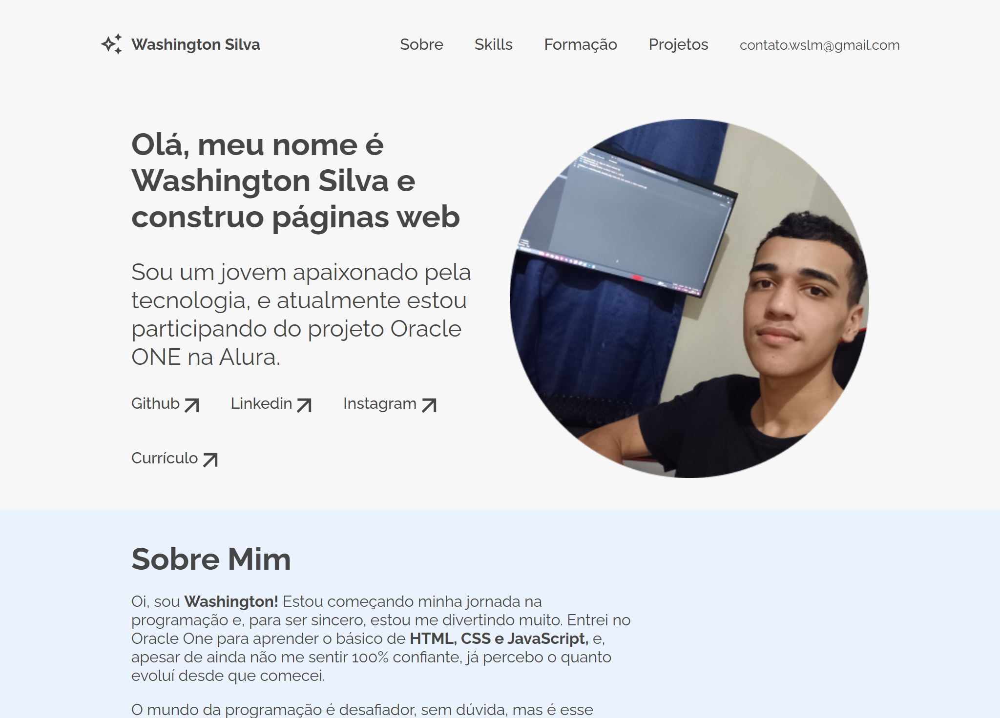

# Projeto Portfólio
Projeto desenvolvido como parte do programa Oracle One.

## Sobre o Projeto
Este projeto foi desenvolvido como um exercício no programa Oracle One.  
O objetivo era criar uma página de portfólio para apresentar um pouco sobre mim e os projetos que tenho desenvolvido. 

Como parte opcional do projeto, foi implementado um formulário com validações simples para campos obrigatórios, utilizando JavaScript.

## Tecnologias Utilizadas
- **HTML**
- **CSS**
- **JavaScript**
